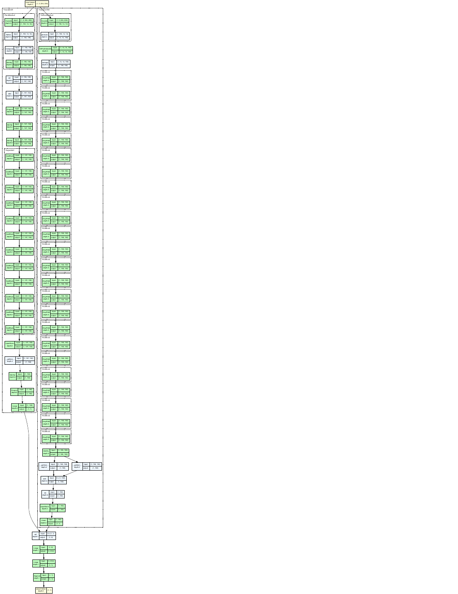

<h1 align="center">🕵️ Deepfake Detection — Vision-KAN + Vision-LSTM</h1>

<p align="center">
  A hybrid, frame-level deepfake detector that fuses a <b>Vision-KAN</b> transformer
  with a <b>Vision-LSTM</b> backbone to tell real faces from manipulated ones.
</p>

<p align="center">
  
  
  
  
  
</p>

---

## ✨ Try it — upload an image, get REAL / FAKE

This repo ships an interactive web demo. Drop in a face image and the model
returns a **real vs. fake** verdict with a confidence score.

```bash
pip install -r requirements.txt
python app.py          # opens a local Gradio app in your browser
```

> 🌐 **Live demo:** https://huggingface.co/spaces/Isit1/deepfake-detector

<p align="center">
  
</p>

---

## 📌 Overview

Deepfakes alter facial expressions, swap identities, and synthesize fake scenes
that are hard to distinguish from real footage. This project tackles **frame-level**
detection: given a single face image, decide whether it is authentic or manipulated.

Instead of relying on a single CNN, we fuse two complementary backbones:

| Backbone        | Role                                                                 |
| --------------- | ------------------------------------------------------------------- |
| **Vision-KAN**  | Transformer-style spatial encoder — captures texture artifacts, lighting and boundary inconsistencies across the face. |
| **Vision-LSTM** | Models ordered relationships **across patch tokens** within a single frame, surfacing subtle structural irregularities. |

Each backbone outputs a scalar logit. The two logits are concatenated and passed
through a small MLP (`2 → 512 → 1 → sigmoid`) — a **late-fusion** classifier that
combines the strengths of both encoders.

```
image → 224×224 → ImageNet norm
                     ├── Vision-KAN  ─→ logit ┐
                     └── Vision-LSTM ─→ logit ┴→ concat → Linear → ReLU → Linear → sigmoid → REAL / FAKE
```

---

## 📊 Results

Evaluated on a DFDC-derived frame test set.

| Model                     | Accuracy | F1 Score |
| ------------------------- | :------: | :------: |
| XceptionNet (ref.)        |  89.0%   |  0.880   |
| ResNet-50 (ref.)          |  88.5%   |  0.870   |
| **CombinedModel (ours)**  | **96.5%** | **0.963** |

Confusion matrix on the held-out test set (9,946 frames): high true-positive and
true-negative rates with balanced false positives/negatives — a well-behaved
decision boundary. Full discussion is in [`docs/Project_Report.pdf`](docs/Project_Report.pdf).

---

## 🗂️ Repository structure

```
deepfake-detector/
├── app.py                      # Interactive Gradio demo (upload → REAL/FAKE)
├── src/
│   └── model.py                # CombinedModel + build/load/predict (single source of truth)
├── examples/                   # Sample images wired into the demo
│   ├── real_sample.jpg
│   └── fake_sample.jpg
├── notebooks/
│   ├── DFDC_Train_Mac.ipynb    # Training pipeline
│   └── test_mac.ipynb          # Original inference notebook
├── deployment/                 # (optional) compile the model with IREE for edge runtimes
│   ├── compile_deepfake_iree.py
│   └── compile_vit_iree.py
├── docs/
│   └── Project_Report.pdf      # Full write-up
├── assets/architecture.png
├── requirements.txt
└── .gitignore
```

---

## ⚙️ Setup

```bash
git clone https://github.com/Isitthakkar11/Deepfake-Detection-using-Vision-KAN-Vision-LSTM.git
cd Deepfake-Detection-using-Vision-KAN-Vision-LSTM
pip install -r requirements.txt
```

The **Vision-LSTM** backbone is fetched automatically via `torch.hub`
(`nx-ai/vision-lstm`) on first run, and **Vision-KAN** installs from PyPI
(`VisionKAN`). No manual model surgery required.

### Get the trained weights

The trained checkpoint `as_model_best.pt` (~71 MB) is **not committed** to keep the
repo light. Place it in the project root before running the demo:

- Download it from this repo's **[Releases](../../releases)** (recommended), **or**
- Re-train using `notebooks/DFDC_Train_Mac.ipynb`.

On a hosted Space you can also set `WEIGHTS_URL` and the app will download it on boot.

---

## 🚀 Run the demo

```bash
python app.py
```

Then open the local URL Gradio prints. Upload a cropped face image (or click an
example) and you'll get a **REAL** / **FAKE** verdict plus confidence bars.

The same logic in plain Python:

```python
from PIL import Image
from src.model import load_model, predict

model = load_model("as_model_best.pt")
label, prob = predict(model, Image.open("examples/real_sample.jpg"))
print(label, f"{prob:.3f}")     # e.g. REAL 0.91
```

---

## 🧠 Bonus: compiled for edge runtimes (optional)

`deployment/` contains scripts that export the model to **ONNX** and compile it
with **IREE/MLIR** down to a portable `.vmfb` flatbuffer — useful for running
inference outside Python. These are optional and not needed for the demo.

---

## 🧪 Dataset

[DeepFake Detection Challenge (DFDC)](https://www.kaggle.com/c/deepfake-detection-challenge)
by Facebook AI — 100k+ videos with real and manipulated faces. We use a
frame-extracted, face-cropped derivative resized to 224×224 and ImageNet-normalized.

---

## 👥 Authors

- **Isit Thakkar** — UTA ID 1002229820
- **Krushna Bhujbal** — UTA ID 1002241902

UTA · CSE-6367 Computer Vision

---

## 📚 References

- D. Afchar et al., *MesoNet: a Compact Facial Video Forgery Detection Network*, 2018.
- H. H. Nguyen et al., *Capsule-Forensics*, ICASSP 2019.
- A. Rössler et al., *FaceForensics*, ICCV 2019.
- DeepFake Detection Challenge Dataset (Kaggle).

---

<p align="center"><i>Deepfake detection is not just a software challenge — it's a trust challenge.</i></p>
